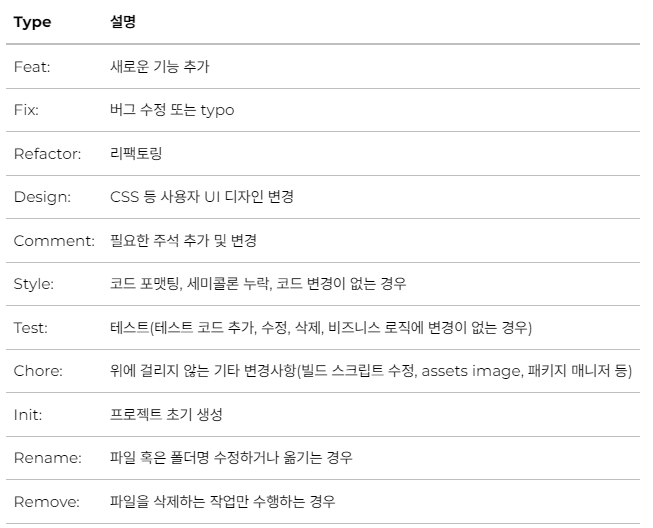

**태그: 제목 의 형태이며  :  뒤에만 space가 있음에 유의한다.**



### Subject

- 제목은 최대 50글자가 넘지 않도록 하고 마침표 및 특수기호는 사용하지 않는다.
- 영문으로 표기하는 경우 동사(원형)를 가장 앞에 두고 첫 글자는 대문자로 표기한다.(과거 시제를 사용하지 않는다.)
- 제목은 **개조식 구문**으로 작성한다. --> 완전한 서술형 문장이 아니라, 간결하고 요점적인 서술을 의미.

### Body

- 본문은 한 줄 당 72자 내로 작성한다.
- 본문 내용은 양에 구애받지 않고 최대한 상세히 작성한다.
- 본문 내용은 어떻게 변경했는지 보다 무엇을 변경했는지 또는 왜 변경했는지를 설명한다.

### 예시

```java
fix: dto 수정

feat: counting 기능 추가
```
