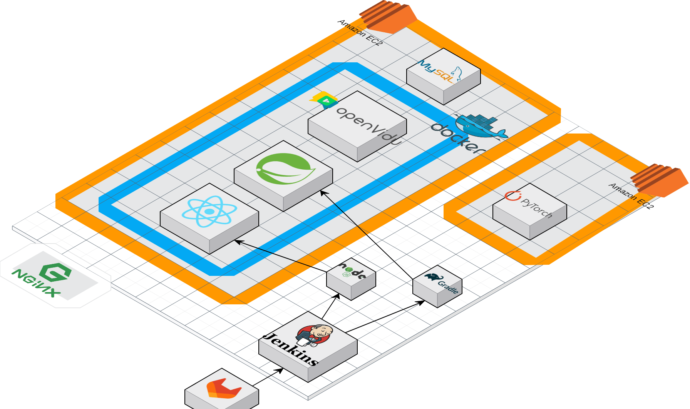
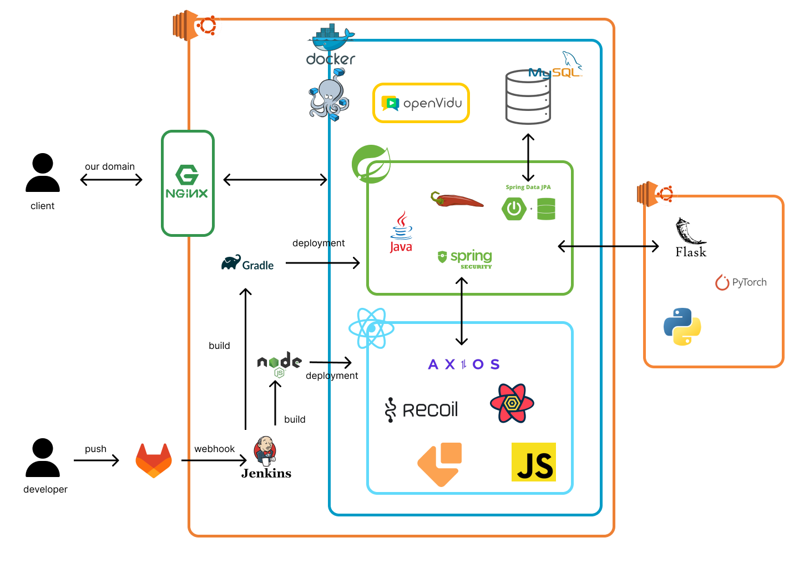
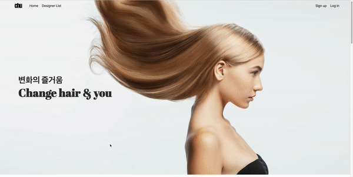
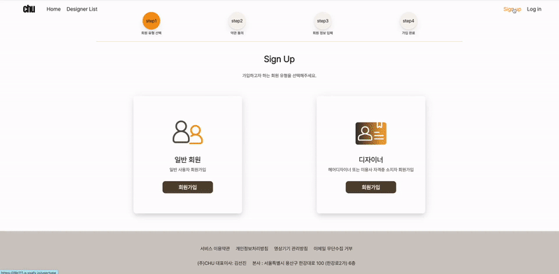
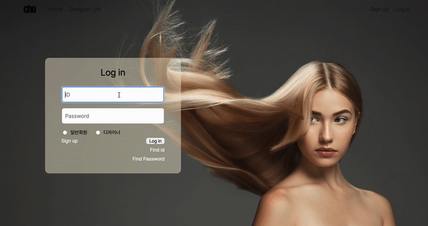
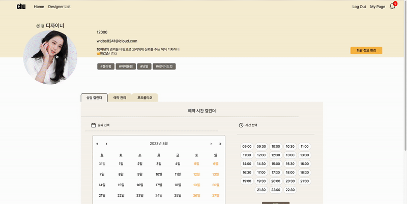
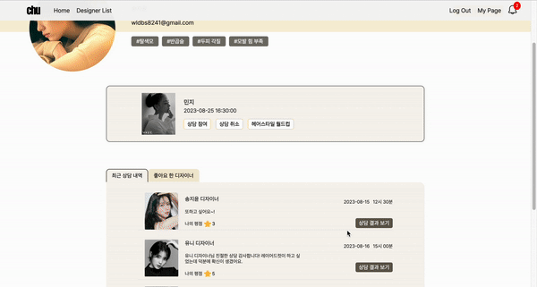

# 프로젝트 주제

## 📍  프로젝트 개요

기간

목적

참여 인원 및 역할 (깃허브 링크걸기 )

목차 (하단 목차 작성)

## 📍 개발 환경 및 문서

### 기술 스택

### 개발 환경

### 시스템 아키텍처

### 간트 차트
https://docs.google.com/spreadsheets/d/1UO3vgIUSMZs43wtq_wPPuFaHoJF-0uUxJ5GngYCNq4I/edit#gid=0

### 기능 명세서

### ERD

### API 연동 규격서

### 라우팅 명세서

### 와이어 프레임

### 포팅 메뉴얼

### 발표 자료 (etc 디렉토리에 파일 추가)

### UCC (youtube 업로드 후 링크)

## 📍 시연 시나리오
(etc>readmeImg 아래 넣어놓기)
(기능 간단하게 소개하기)
### 메인화면
- 서비스 대표 기능 소개 및 바로가기 

### 디자이너 회원가입
- 아이디 중복체크, 비밀번호 확인, 이메일 중복 체크

### 로그인 페이지
- 일반회원과 디자이너 구분지어 로그인 

### 디자이너 마이페이지
- 프로필 사진 변경
- 상담 예약 가능 시간 등록 및 취소 캘린더로 관리
- 예약 목록 확인
- 포트폴리오 등록 및 삭제
- 개인정보 수정
  

### 디자이너 리스트뷰
- 원하는 디자이너 좋아요 기능
- 디자이너 리스트에 정렬 적용
- 스타일 필터 적용
- 디자이너 이름으로 검색
- 주변 디자이너 검색: 카카오지도 API 사용
  

### 디자이너 상세 뷰
- 디자이너의 좋아요 클릭 및 취소
- 디자이너 상세 정보 및 포트폴리오, 후기 확인
- 예약 페이지 버튼

### 예약 페이지

### 고객 마이페이지
- 진행될 상담 목록 및 과거 상담 예약 내역 확인
- 좋아요 한 디자이너 확인 및 취소
- 회원 정보 수정
  

### 상담 화면

### 알림 화면

### 후기 작성

### 이상형 월드컵 

### 한 장 한 장

## 📍 디렉토리 구조
