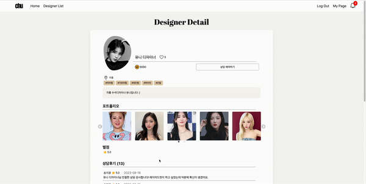

# 프로젝트 주제

# 📍  프로젝트 개요

### 기간
2023.06.26 ~ 2023.08.18

### 목적
AI 모델을 활용한 화상 퍼스널 헤어 컨설팅 서비스

### 참여 인원 및 역할
|  |  |  |   |   |
| :--: |:--: |:--: |:--: |:--: |
| [김선진](https://github.com/sunjinb) | [김하진](https://github.com/hajin618) | [류민지](https://github.com/mxnzx) | [송지윤](https://github.com/wldbs8241) | [원재현](https://github.com/dubu777) 

# 📍 개발 환경 및 문서

## 기술 스택

## 개발 환경
[개발환경](./Etc/Docs/개발환경.md)

### 시스템 아키텍처

## 간트 차트
[간트 차트](./Etc/Docs/간트차트.md)

## 기능 명세서
[기능 명세서](./Etc/Docs/11팀_요구사항정의서.xlsx)

## ERD
[ERD](./Etc/Docs/ERD.md)

## API 연동 규격서
[API 연동 규격서](./Etc/Docs/api명세서.md)

## 라우팅 명세서
[라우팅 명세서](./Etc/Docs/라우팅명세서.md)

## 와이어 프레임
[Wireframe](./Etc/Docs/Wireframe.md)

## 포팅 메뉴얼
[포팅 메뉴얼](./Exec/포팅메뉴얼.pdf)

## 발표 자료 (Etc 디렉토리에 파일 추가)
[발표 자료](./Etc/Docs/발표자료.pptx)

## UCC (youtube 업로드 후 링크)

# 📍 시연 시나리오
(Etc>readmeImg 아래 넣어놓기)
(기능 간단하게 소개하기)
## 메인화면
- 서비스 대표 기능 소개 및 바로가기 

## 디자이너 회원가입
- 아이디 중복체크, 비밀번호 확인, 이메일 중복 체크

## 로그인 페이지
- 일반회원과 디자이너 구분지어 로그인 

## 디자이너 마이페이지
- 프로필 사진 변경
- 상담 예약 가능 시간 등록 및 취소 캘린더로 관리
- 예약 목록 확인
- 포트폴리오 등록 및 삭제
- 개인정보 수정
  

## 디자이너 리스트뷰
- 원하는 디자이너 좋아요 기능
- 디자이너 리스트에 정렬 적용
- 스타일 필터 적용
- 디자이너 이름으로 검색
- 주변 디자이너 검색: 카카오지도 API 사용
  

## 디자이너 상세 뷰
- 디자이너의 좋아요 클릭 및 취소
- 디자이너 상세 정보 및 포트폴리오, 후기 확인
- 예약 페이지 버튼

## 예약 페이지
- 상담 예약 시간 선택
- 상담 예약 시 전달 사항 작성
- 원하는 헤어 포트폴리오 이미지 선택(최대8장)
- 본인 얼굴 이미지 첨부
- 카카오페이 결제 및 예약 확정
  

## 고객 마이페이지
- 진행될 상담 목록 및 과거 상담 예약 내역 확인
- 좋아요 한 디자이너 확인 및 취소
- 회원 정보 수정
  

## 상담 및 후기 작성
- OpenVidu를 활용한 상담 진행
- 상담 종료 후 고객 후기 작성
- 별점, 한줄평 작성

[디자이너]   
  

[고객]  

## 알림 화면  
- 고객 상담 취소 시 디자이너 알림 생성
  

## 이상형 월드컵 
- 상담 예약 확정 후 월드컵 방 생성
- 입장 후 지인들과 url 공유
- 최대 4명 구성으로 월드컵 진행
    

## 한 장 한 장

